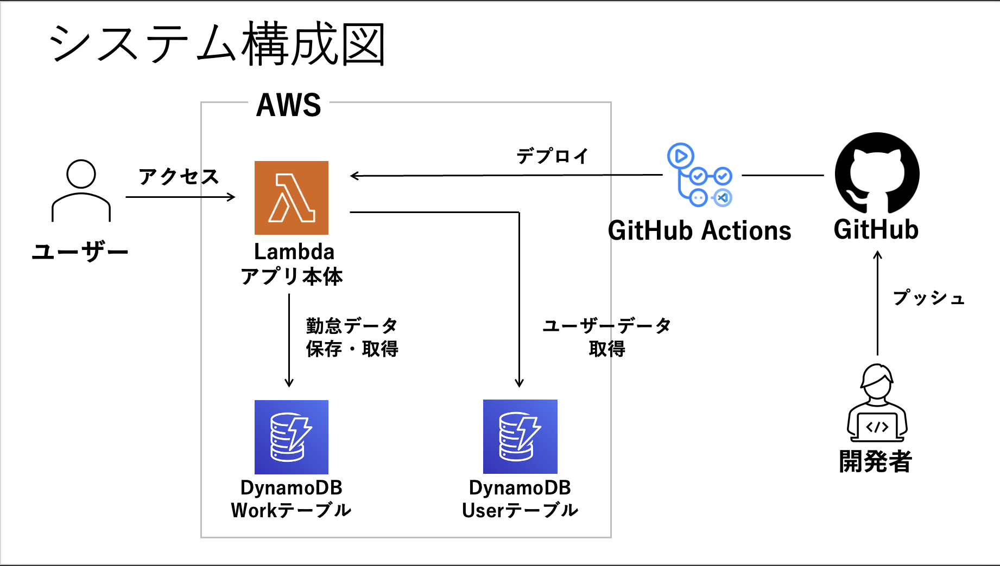

# 勤怠管理アプリ

## アプリ概要

| 項目 | 内容 |
|---|---|
| アプリ名 | 勤怠管理アプリ |
| 概要 | 勤務時間の記録・想定月給与の確認が可能なWEBアプリ |
| 動作環境 | AWS Lambda（本番） |

### 技術スタック

| 分類 | 技術 |
|---|---|
| 言語 | Python 3.12 |
| Webフレームワーク | FastAPI / uvicorn |
| レンダリング | SSR（Jinja2テンプレート） |
| フロントエンド | HTMX / Alpine.js |
| 認証 | PyJWT（HS256・Cookie） |
| データベース | Amazon DynamoDB |
| AWSアダプター | Mangum |
| パスワードハッシュ | bcrypt |
| AWSクライアント | boto3 |

---

## 画面構成と機能

### ログイン画面 `/auth/login`
- ユーザー名とパスワードで認証する
- 認証成功時に JWT を Cookie に発行し、ダッシュボードへリダイレクトする
- ユーザー登録・編集は DynamoDB コンソールから直接行う（管理画面は未実装）

### ダッシュボード画面 `/dashboard`
- 当日の勤怠ステータス（出勤中 / 退勤済 / 未打刻）を表示する
- 当月の合計勤務時間と想定月給与を表示する
- 想定月給与 = 月の総勤務時間（時間換算）× 時給

### 打刻画面 `/punch`
- 出勤打刻・退勤打刻を行う
- 打刻時刻は DynamoDB の Workテーブルに保存する

### 勤務履歴画面 `/history`
- 月単位のカレンダー形式で勤務履歴を表示する
- 月ナビゲーションで前後の月を切り替えられる
- 各日の打刻時刻をインラインで修正できる（HTMX による部分更新）

### 設定画面 `/settings`
- 時給（円/時）を更新する
- 月次集計はDBに保存せず都度算出する

---

## ディレクトリ・ファイル構成

```
.
├── src/
│   ├── main.py               # アプリ本体・Mangum ハンドラー定義
│   ├── database.py           # DB接続・テーブル定義
│   ├── routers/              # ルーター層（HTTP エンドポイント）
│   │   ├── auth.py
│   │   ├── dashboard.py
│   │   ├── punch.py
│   │   ├── history.py
│   │   └── settings.py
│   ├── services/             # サービス層（ビジネスロジック）
│   │   ├── auth_service.py
│   │   └── work_service.py
│   ├── repositories/         # リポジトリ層（DynamoDB 操作）
│   │   ├── user_repository.py
│   │   └── work_repository.py
│   ├── utils/                # ユーティリティ関数
│   │   └── salary.py
│   ├── templates/            # Jinja2 HTMLテンプレート
│   └── static/               # 静的ファイル
│       ├── css/
│       └── js/
├── tests/                    # テストコード
├── config/                   # 設定・ドキュメント（読み取り専用）
├── scripts/                  # 開発補助スクリプト
├── .claude/
│   ├── commands/             # Claude Code カスタムコマンド
│   └── agents/               # サブエージェント定義
├── .venv/                    # 仮想環境
└── requirements.txt
```

## システム構成図


---